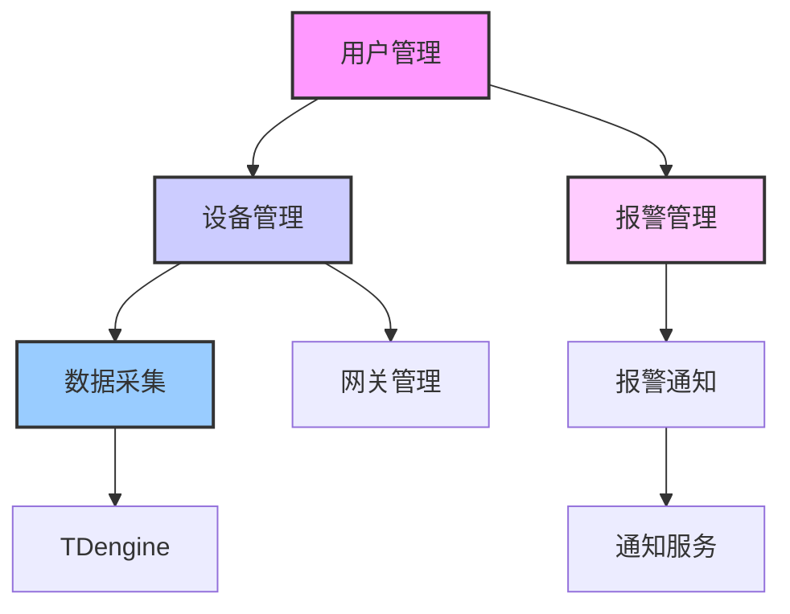

# 🏗️ PostgreSQL业务Schema设计

## 🎯 设计目标
为物联网温湿度监控系统设计PostgreSQL业务Schema，支持：
1. **用户管理和权限控制** (普通用户/超级管理员双角色)
2. **设备管理** (网关、标签设备、传感器)
3. **组织架构** (多租户支持)
4. **报警规则管理**
5. **系统配置**
6. **与TDengine时序数据关联**

## 📋 设计原则
1. **业务与数据分离**: PostgreSQL只存储业务关系数据，时序数据存储在TDengine
2. **扩展性**: 支持多租户、多组织架构
3. **安全性**: 完善的权限控制和审计日志
4. **性能**: 合理的索引和分区策略
5. **一致性**: 确保业务数据与时序数据关联一致

## 🏗️ 实体关系设计

### 1. **用户管理模块**
```
用户(User) → 角色(Role) → 权限(Permission)
用户属于组织(Organization)
用户创建设备(Device)
用户管理报警规则(AlarmRule)
```

### 2. **设备管理模块**
```
网关(Gateway) → 标签设备(Device) → 传感器(Sensor)
网关属于组织(Organization)
设备绑定到网关(Gateway)
设备有报警规则(AlarmRule)
```

### 3. **报警管理模块**
```
报警规则(AlarmRule) → 报警记录(AlarmHistory)
规则关联设备(Device)或传感器(Sensor)
报警触发后在TDengine存储详细时序数据
```

### 4. **数据关联设计**
```
PostgreSQL (业务数据) ←→ TDengine (时序数据)
通过 device_id, sensor_id, gateway_id 关联
```

## 📊 数据库表设计

### 1. **用户表 (users)**
```sql
CREATE TABLE users (
    id BIGSERIAL PRIMARY KEY,
    username VARCHAR(50) UNIQUE NOT NULL,
    email VARCHAR(100) UNIQUE NOT NULL,
    phone VARCHAR(20),
    password_hash VARCHAR(255) NOT NULL,
    full_name VARCHAR(100),
    avatar_url VARCHAR(255),
    
    -- 角色和权限
    role VARCHAR(20) DEFAULT 'USER', -- USER, ADMIN, SUPER_ADMIN
    is_active BOOLEAN DEFAULT TRUE,
    is_email_verified BOOLEAN DEFAULT FALSE,
    is_phone_verified BOOLEAN DEFAULT FALSE,
    
    -- 组织关联
    organization_id BIGINT REFERENCES organizations(id),
    
    -- 时间和审计
    created_at TIMESTAMP DEFAULT CURRENT_TIMESTAMP,
    updated_at TIMESTAMP DEFAULT CURRENT_TIMESTAMP,
    last_login_at TIMESTAMP,
    login_count INTEGER DEFAULT 0,
    
    -- 扩展字段
    settings JSONB DEFAULT '{}',
    metadata JSONB DEFAULT '{}',
    
    -- 索引
    INDEX idx_users_username(username),
    INDEX idx_users_email(email),
    INDEX idx_users_organization(organization_id),
    INDEX idx_users_role(role, is_active)
);
```

### 2. **组织表 (organizations)**
```sql
CREATE TABLE organizations (
    id BIGSERIAL PRIMARY KEY,
    name VARCHAR(100) NOT NULL,
    code VARCHAR(50) UNIQUE NOT NULL, -- 组织编码
    description TEXT,
    
    -- 联系方式
    contact_person VARCHAR(100),
    contact_phone VARCHAR(20),
    contact_email VARCHAR(100),
    address TEXT,
    
    -- 状态
    status VARCHAR(20) DEFAULT 'ACTIVE', -- ACTIVE, INACTIVE, SUSPENDED
    max_users INTEGER DEFAULT 10,
    max_devices INTEGER DEFAULT 100,
    
    -- 时间
    created_at TIMESTAMP DEFAULT CURRENT_TIMESTAMP,
    updated_at TIMESTAMP DEFAULT CURRENT_TIMESTAMP,
    expires_at TIMESTAMP,
    
    -- 扩展
    settings JSONB DEFAULT '{}',
    metadata JSONB DEFAULT '{}',
    
    -- 索引
    INDEX idx_organizations_code(code),
    INDEX idx_organizations_status(status)
);
```

### 3. **网关表 (gateways)**
```sql
CREATE TABLE gateways (
    id BIGSERIAL PRIMARY KEY,
    gateway_sn VARCHAR(50) UNIQUE NOT NULL, -- SIM卡ICCID (唯一设备号)
    name VARCHAR(100) NOT NULL,
    description TEXT,
    
    -- 组织关联
    organization_id BIGINT REFERENCES organizations(id),
    
    -- 设备信息
    model VARCHAR(50),
    manufacturer VARCHAR(100),
    firmware_version VARCHAR(20),
    hardware_version VARCHAR(20),
    
    -- 网络信息
    ip_address INET,
    mac_address VARCHAR(17),
    sim_card_number VARCHAR(20),
    network_operator VARCHAR(50),
    
    -- 位置信息
    location_description VARCHAR(200),
    latitude DECIMAL(10, 8),
    longitude DECIMAL(11, 8),
    altitude DECIMAL(8, 2),
    
    -- 状态
    status VARCHAR(20) DEFAULT 'OFFLINE', -- ONLINE, OFFLINE, MAINTENANCE
    is_active BOOLEAN DEFAULT TRUE,
    last_seen_at TIMESTAMP,
    last_data_received_at TIMESTAMP,
    
    -- 配置
    mqtt_topic_prefix VARCHAR(100),
    http_config_url VARCHAR(255),
    report_interval INTEGER DEFAULT 60, -- 上报间隔(秒)
    
    -- 时间
    created_at TIMESTAMP DEFAULT CURRENT_TIMESTAMP,
    updated_at TIMESTAMP DEFAULT CURRENT_TIMESTAMP,
    activated_at TIMESTAMP,
    
    -- 统计
    total_devices INTEGER DEFAULT 0,
    total_data_points BIGINT DEFAULT 0,
    
    -- 扩展
    config JSONB DEFAULT '{}',
    metadata JSONB DEFAULT '{}',
    
    -- 索引
    INDEX idx_gateways_sn(gateway_sn),
    INDEX idx_gateways_organization(organization_id),
    INDEX idx_gateways_status(status, is_active),
    INDEX idx_gateways_last_seen(last_seen_at)
);
```

### 4. **设备表 (devices)**
```sql
CREATE TABLE devices (
    id BIGSERIAL PRIMARY KEY,
    device_sn VARCHAR(50) UNIQUE NOT NULL, -- 设备序列号
    name VARCHAR(100) NOT NULL,
    description TEXT,
    
    -- 关联关系
    gateway_id BIGINT REFERENCES gateways(id),
    organization_id BIGINT REFERENCES organizations(id),
    
    -- 设备信息
    device_type VARCHAR(30) DEFAULT 'TEMPERATURE_HUMIDITY', -- 设备类型
    model VARCHAR(50),
    manufacturer VARCHAR(100),
    firmware_version VARCHAR(20),
    
    -- 传感器配置
    sensor_type VARCHAR(50), -- 传感器类型
    measurement_unit VARCHAR(20), -- 测量单位
    precision DECIMAL(5, 2), -- 精度
    sampling_rate INTEGER, -- 采样率(秒)
    
    -- 位置信息
    location_description VARCHAR(200),
    installation_date DATE,
    
    -- 状态
    status VARCHAR(20) DEFAULT 'INACTIVE', -- ACTIVE, INACTIVE, FAULTY, MAINTENANCE
    is_online BOOLEAN DEFAULT FALSE,
    last_seen_at TIMESTAMP,
    battery_level INTEGER, -- 电池电量(0-100)
    signal_strength INTEGER, -- 信号强度(0-100)
    
    -- 报警配置
    temperature_threshold_high DECIMAL(5, 2), -- 高温阈值
    temperature_threshold_low DECIMAL(5, 2),  -- 低温阈值
    humidity_threshold_high DECIMAL(5, 2),   -- 高湿阈值
    humidity_threshold_low DECIMAL(5, 2),    -- 低湿阈值
    battery_threshold_low INTEGER DEFAULT 20, -- 低电量阈值
    
    -- 时间
    created_at TIMESTAMP DEFAULT CURRENT_TIMESTAMP,
    updated_at TIMESTAMP DEFAULT CURRENT_TIMESTAMP,
    activated_at TIMESTAMP,
    
    -- 统计
    total_readings BIGINT DEFAULT 0,
    total_alarms INTEGER DEFAULT 0,
    
    -- TDengine关联
    tdengine_table_name VARCHAR(100), -- 对应的TDengine子表名
    
    -- 扩展
    config JSONB DEFAULT '{}',
    metadata JSONB DEFAULT '{}',
    
    -- 索引
    INDEX idx_devices_sn(device_sn),
    INDEX idx_devices_gateway(gateway_id),
    INDEX idx_devices_organization(organization_id),
    INDEX idx_devices_status(status, is_online),
    INDEX idx_devices_last_seen(last_seen_at)
);
```

### 5. **报警规则表 (alarm_rules)**
```sql
CREATE TABLE alarm_rules (
    id BIGSERIAL PRIMARY KEY,
    name VARCHAR(100) NOT NULL,
    description TEXT,
    
    -- 关联关系
    device_id BIGINT REFERENCES devices(id),
    organization_id BIGINT REFERENCES organizations(id),
    created_by BIGINT REFERENCES users(id),
    
    -- 规则类型
    rule_type VARCHAR(30) NOT NULL, -- TEMPERATURE_HIGH, TEMPERATURE_LOW, HUMIDITY_HIGH, HUMIDITY_LOW, OFFLINE, BATTERY_LOW
    severity VARCHAR(20) DEFAULT 'MEDIUM', -- CRITICAL, HIGH, MEDIUM, LOW
    
    -- 条件配置
    condition_operator VARCHAR(10), -- >, <, >=, <=, =
    threshold_value DECIMAL(10, 2),
    duration_threshold INTEGER, -- 持续时间阈值(秒)
    
    -- 报警动作
    enabled BOOLEAN DEFAULT TRUE,
    notification_channels JSONB DEFAULT '["EMAIL", "SMS"]', -- 通知渠道
    auto_acknowledge BOOLEAN DEFAULT FALSE,
    auto_resolve BOOLEAN DEFAULT FALSE,
    escalation_policy JSONB, -- 升级策略
    
    -- 时间
    created_at TIMESTAMP DEFAULT CURRENT_TIMESTAMP,
    updated_at TIMESTAMP DEFAULT CURRENT_TIMESTAMP,
    last_triggered_at TIMESTAMP,
    
    -- 统计
    trigger_count INTEGER DEFAULT 0,
    
    -- 扩展
    config JSONB DEFAULT '{}',
    metadata JSONB DEFAULT '{}',
    
    -- 索引
    INDEX idx_alarm_rules_device(device_id),
    INDEX idx_alarm_rules_organization(organization_id),
    INDEX idx_alarm_rules_type(rule_type, enabled),
    INDEX idx_alarm_rules_last_triggered(last_triggered_at)
);
```

### 6. **报警记录表 (alarm_history)**
```sql
CREATE TABLE alarm_history (
    id BIGSERIAL PRIMARY KEY,
    
    -- 关联关系
    alarm_rule_id BIGINT REFERENCES alarm_rules(id),
    device_id BIGINT REFERENCES devices(id),
    organization_id BIGINT REFERENCES organizations(id),
    
    -- 报警信息
    alarm_type VARCHAR(30) NOT NULL,
    severity VARCHAR(20) NOT NULL,
    trigger_value DECIMAL(10, 2),
    threshold_value DECIMAL(10, 2),
    message TEXT,
    
    -- 状态
    status VARCHAR(20) DEFAULT 'PENDING', -- PENDING, ACKNOWLEDGED, RESOLVED, IGNORED
    acknowledged_by BIGINT REFERENCES users(id),
    acknowledged_at TIMESTAMP,
    resolved_by BIGINT REFERENCES users(id),
    resolved_at TIMESTAMP,
    
    -- 时间
    triggered_at TIMESTAMP DEFAULT CURRENT_TIMESTAMP,
    resolved_at TIMESTAMP,
    duration_seconds INTEGER, -- 持续时间(秒)
    
    -- TDengine关联
    tdengine_alarm_id BIGINT, -- 对应TDengine中的报警记录ID
    
    -- 扩展
    details JSONB DEFAULT '{}',
    
    -- 索引
    INDEX idx_alarm_history_device(device_id),
    INDEX idx_alarm_history_status(status, triggered_at),
    INDEX idx_alarm_history_organization(organization_id, triggered_at),
    INDEX idx_alarm_history_rule(alarm_rule_id, triggered_at)
);
```

### 7. **设备绑定表 (device_bindings)**
```sql
CREATE TABLE device_bindings (
    id BIGSERIAL PRIMARY KEY,
    
    -- 关联关系
    device_id BIGINT REFERENCES devices(id),
    gateway_id BIGINT REFERENCES gateways(id),
    organization_id BIGINT REFERENCES organizations(id),
    
    -- 绑定信息
    binding_type VARCHAR(20) DEFAULT 'AUTO', -- AUTO, MANUAL, QR_CODE
    binding_code VARCHAR(50), -- 绑定码/二维码
    bound_by BIGINT REFERENCES users(id),
    
    -- 状态
    status VARCHAR(20) DEFAULT 'ACTIVE', -- ACTIVE, INACTIVE, PENDING
    is_primary BOOLEAN DEFAULT FALSE, -- 是否为主要绑定
    
    -- 时间
    bound_at TIMESTAMP DEFAULT CURRENT_TIMESTAMP,
    unbound_at TIMESTAMP,
    expires_at TIMESTAMP,
    
    -- 扩展
    config JSONB DEFAULT '{}',
    metadata JSONB DEFAULT '{}',
    
    -- 索引
    UNIQUE(device_id, gateway_id, organization_id),
    INDEX idx_device_bindings_device(device_id),
    INDEX idx_device_bindings_gateway(gateway_id),
    INDEX idx_device_bindings_status(status)
);
```

### 8. **系统配置表 (system_configs)**
```sql
CREATE TABLE system_configs (
    id BIGSERIAL PRIMARY KEY,
    
    -- 配置信息
    config_key VARCHAR(100) UNIQUE NOT NULL,
    config_value JSONB NOT NULL,
    config_type VARCHAR(30) DEFAULT 'STRING', -- STRING, NUMBER, BOOLEAN, JSON, ARRAY
    description TEXT,
    
    -- 作用域
    scope VARCHAR(30) DEFAULT 'SYSTEM', -- SYSTEM, ORGANIZATION, USER
    organization_id BIGINT REFERENCES organizations(id),
    user_id BIGINT REFERENCES users(id),
    
    -- 状态
    is_encrypted BOOLEAN DEFAULT FALSE,
    is_public BOOLEAN DEFAULT FALSE,
    is_readonly BOOLEAN DEFAULT FALSE,
    
    -- 版本控制
    version INTEGER DEFAULT 1,
    previous_value JSONB,
    
    -- 时间
    created_at TIMESTAMP DEFAULT CURRENT_TIMESTAMP,
    updated_at TIMESTAMP DEFAULT CURRENT_TIMESTAMP,
    effective_from TIMESTAMP DEFAULT CURRENT_TIMESTAMP,
    effective_to TIMESTAMP,
    
    -- 扩展
    metadata JSONB DEFAULT '{}',
    
    -- 索引
    INDEX idx_system_configs_key(config_key),
    INDEX idx_system_configs_scope(scope, organization_id, user_id),
    INDEX idx_system_configs_effective(effective_from, effective_to)
);
```

### 9. **审计日志表 (audit_logs)**
```sql
CREATE TABLE audit_logs (
    id BIGSERIAL PRIMARY KEY,
    
    -- 操作信息
    action VARCHAR(50) NOT NULL, -- CREATE, UPDATE, DELETE, LOGIN, LOGOUT
    resource_type VARCHAR(50) NOT NULL, -- USER, DEVICE, GATEWAY, ALARM
    resource_id BIGINT,
    resource_name VARCHAR(100),
    
    -- 操作者
    user_id BIGINT REFERENCES users(id),
    user_ip INET,
    user_agent TEXT,
    
    -- 操作详情
    old_value JSONB,
    new_value JSONB,
    changes JSONB,
    success BOOLEAN DEFAULT TRUE,
    error_message TEXT,
    
    -- 时间
    created_at TIMESTAMP DEFAULT CURRENT_TIMESTAMP,
    
    -- 扩展
    metadata JSONB DEFAULT '{}',
    
    -- 索引
    INDEX idx_audit_logs_action(action, created_at),
    INDEX idx_audit_logs_user(user_id, created_at),
    INDEX idx_audit_logs_resource(resource_type, resource_id, created_at)
);
```

## 🔗 数据关联设计

### PostgreSQL ↔ TDengine 关联
```sql
-- 通过device_id关联
-- PostgreSQL.devices.id = TDengine.sensor_data.device_id

-- 通过gateway_id关联  
-- PostgreSQL.gateways.id = TDengine.gateway_status.gateway_id

-- 通过sensor_id关联
-- PostgreSQL.devices.id = TDengine.sensor_data.sensor_id
```

### 数据同步策略
1. **实时同步**: 设备状态、网关状态
2. **定期同步**: 统计信息、报表数据
3. **事件驱动**: 报警触发、状态变更

## 📈 性能优化策略

### 1. **分区策略**
```sql
-- 按时间分区 (报警记录、审计日志)
CREATE TABLE alarm_history_2024 PARTITION OF alarm_history
FOR VALUES FROM ('2024-01-01') TO ('2025-01-01');

-- 按组织分区 (大型多租户场景)
CREATE TABLE devices_org_1 PARTITION OF devices
FOR VALUES IN (1);
```

### 2. **索引策略**
```sql
-- 复合索引
CREATE INDEX idx_devices_status_org ON devices(status, organization_id, created_at);

-- 部分索引
CREATE INDEX idx_active_devices ON devices(id) WHERE status = 'ACTIVE';

-- GIN索引 (JSON字段)
CREATE INDEX idx_devices_config ON devices USING GIN(config);
```

### 3. **物化视图**
```sql
-- 设备统计物化视图
CREATE MATERIALIZED VIEW device_stats_daily AS
SELECT 
    device_id,
    DATE(created_at) as stat_date,
    COUNT(*) as reading_count,
    AVG(battery_level) as avg_battery,
    MIN(battery_level) as min_battery,
    MAX(battery_level) as max_battery
FROM device_readings
GROUP BY device_id, DATE(created_at);
```

## 🔄 数据迁移脚本

### 初始化脚本
```sql
-- 01-init-schema.sql
-- 创建所有表、索引、约束

-- 02-init-data.sql  
-- 插入默认数据（管理员用户、默认配置等）

-- 03-migration-scripts/
-- 版本迁移脚本
```

## 📊 数据量预估

| 表名 | 初始数据量 | 年增长量 | 存储预估 | 说明 |
|------|-----------|---------|---------|------|
| users | 100-1000 | 10-20% | 10-100MB | 用户数量有限 |
| organizations | 10-100 | 5-10% | 5-50MB | 组织数量有限 |
| gateways | 100-10000 | 20-50% | 50-500MB | 网关可能快速增长 |
| devices | 1000-100000 | 50-100% | 100MB-5GB | 设备数量可能快速增长 |
| alarm_rules | 1000-50000 | 30-60% | 50MB-1GB | 每个设备可能有多个规则 |
| alarm_history | 10000-1000000 | 100-200% | 1GB-50GB | 报警记录会快速增长 |
| audit_logs | 10000-1000000 | 100-200% | 1GB-100GB | 审计日志需要详细记录 |
| system_configs | 100-1000 | 5-10% | 10-100MB | 配置数量有限 |

## 🚀 部署和运维

### 1. **数据库配置**
```yaml
# application.yml中的PostgreSQL配置
spring:
  datasource:
    url: jdbc:postgresql://localhost:5432/iot_weather
    username: iot_user
    password: ${DB_PASSWORD}
    driver-class-name: org.postgresql.Driver
    hikari:
      maximum-pool-size: 20
      minimum-idle: 5
      connection-timeout: 30000
      idle-timeout: 600000
      max-lifetime: 1800000
  jpa:
    hibernate:
      ddl-auto: validate  # 生产环境使用validate
    properties:
      hibernate:
        dialect: org.hibernate.dialect.PostgreSQLDialect
        jdbc:
          batch_size: 50
        order_inserts: true
        order_updates: true
```

### 2. **备份策略**
```sql
-- 每日全量备份
pg_dump -U iot_user -d iot_weather -F c -f /backup/iot_weather_$(date +%Y%m%d).backup

-- 实时WAL归档
archive_mode = on
archive_command = 'cp %p /var/lib/postgresql/wal_archive/%f'
```

### 3. **监控指标**
```sql
-- 连接数监控
SELECT count(*) FROM pg_stat_activity;

-- 表大小监控
SELECT schemaname, tablename, pg_size_pretty(pg_total_relation_size(schemaname||'.'||tablename)) 
FROM pg_tables 
WHERE schemaname NOT IN ('pg_catalog', 'information_schema')
ORDER BY pg_total_relation_size(schemaname||'.'||tablename) DESC;

-- 索引使用情况
SELECT schemaname, tablename, indexname, idx_scan, idx_tup_read, idx_tup_fetch
FROM pg_stat_user_indexes 
ORDER BY idx_scan DESC;
```

## ✅ 验收标准

- [ ] 所有业务实体设计完整
- [ ] 关联关系正确
- [ ] 索引设计合理
- [ ] 分区策略适用
- [ ] 与TDengine关联清晰
- [ ] 性能预估合理
- [ ] 备份恢复策略完整

## 🔧 下一步工作

1. **创建实体类**:
   - 完成所有Java实体类
   - 添加JPA注解
   - 实现业务方法

2. **创建Repository**:
   - 数据访问接口
   - 自定义查询方法
   - 分页和排序支持

3. **创建Service**:
   - 业务逻辑实现
   - 事务管理
   - 异常处理

4. **创建Controller**:
   - REST API接口
   - 参数验证
   - 响应格式

5. **测试**:
   - 单元测试
   - 集成测试
   - 性能测试

## 📋 依赖关系



## 🎯 设计优势

1. **业务与时序数据分离**: PostgreSQL处理业务关系，TDengine处理时序数据
2. **扩展性强**: 支持多租户、多组织架构
3. **安全性高**: 完整的权限控制和审计日志
4. **性能优秀**: 合理的索引和分区策略
5. **维护方便**: 清晰的表结构和文档

---

**设计完成时间**: 2026-03-28 08:40  
**设计者**: OpenClaw执行者  
**下一步**: 创建Java实体类和Repository接口